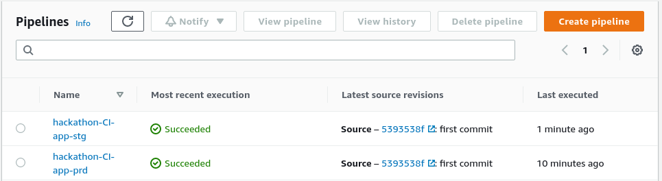
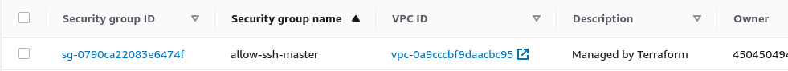
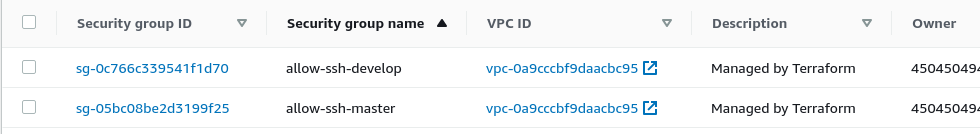

# **Exercicio Hackathon**

## **Requisitos:**

   1. Os Nomes de todos os recursos criados devem conter o workspace.
   2. Crie um ambiente de Dev.
   3. Cada ambiente deve ter seu próprio repósitorio de imagem.
   4. Ao fazer o deploy, deve ser refletida branch com o mesmo nome do workspace.
   5. Serão ambiente com insfraestrutura diferentes.
   6. Faça um zip dos arquivos desse exercicio e submeta no portal da fiap.

---

## **Ajuda**

   1. [How to create modules](https://blog.gruntwork.io/how-to-create-reusable-infrastructure-with-terraform-modules-25526d65f73d)
   2. [Modules Composition](https://www.terraform.io/docs/modules/composition.html)
   3. [Creating Modules](https://www.terraform.io/docs/modules/index.html)
   4. [AWS dataExerciciosources](https://www.terraform.io/docs/providers/aws/d/instances.html)

---

# **Trabalho de Conclusão da Matéria Hybrid Native Cloud.**

Neste trabalho foi utilizado o Terraform para provisionar os recursos na cloud da **AWS**, mantendo o estado remoto num bucket do S3, sendo reflitida a branch no nomes dos recursos que forem criados pela execução do terraform com a utilização de workspaces.

**OBS: A branch `master` reproduz o ambiente de `produção`, e a branch `develop` reproduz o ambiente de `staging`.**

Neste repositório encontra a stack do terraform, e neste [repositório](https://github.com/wellbastos/hybridnativecloud-project-api-pipeline-stack) encontra-se a fução que executa a trigger para executar o pipeline de CD.

## **Processos de Continuous Integration e Continuous Delivery:**

## **Pipelines de CI:**

---

## **ECR - Registry de Production:**

---

## **ECR - Registry de Staging:**

---

## **Copiando Credentials, Config, e ssh key para o Bucket S3:**

---

## **Desativando a trigger automatica do pipeline:**

---

## **Deploy da lambda function que irá executar o pipeline de Produção:** 

---

## **Trigger no pipeline de Produção:** 

---

## **Log de execução do pipeline de Produção:** 

---

## **Status do Pipeline em execução de Produção:** 

---

## **Execução com sucesso do pipeline de Produção:** 

---

## **Steps da execução do pipeline de Produção:** 

---

## **Artefatos gerados pelo processo de CD no ambiente de Produção:**

## **Instância criada pelo pipeline de Produção:** 

---

## **Security Group criado pelo pipeline de Produção:** 

---

## **ELB criado pelo pipeline de Produção:** 

---

## **Aplicação entregue pelo pipeline de Produção:** 

---

## **Artefatos gerados pelo processo de CD no ambiente de Staging:**

## **Status do pipeline de Staging:** 

---

## **Log de execução do pipeline de Staging:** 

---

## **Steps do pipeline de Staging:** 

---

## **Variaveis de ambiente do pipeline de Staging:** 

---

## **Instância criada pelo pipeline de Staging:** 

---

## **Security Group criado pelo pipeline de Staging:** 

---

## **ELB Criado pelo pipeline de Staging:** 

---

## **Aplicação entregue pelo pipeline de Staging** 

---

## **Os dois ambientes em execução simultanea:**

## **Instâncias em execução:** 

---

## **Security groups:** 

---

## **ELBs:** 

---

## **Conteudo do Bucket no S3:** 

---

## **Conteudo da pasta State:** 

---

## **Registry de Staging:** 

---

## **Registry de Produção:** 

---

## **Terraform Destroy no ambiente de Staging:** 

---

## **Terminando a instância de Staging:** 

---

## **Terraform Destroy no ambiente de Produção:** 

---

## **Terminando a instância de Produção:** 

---

### **Grupo:**

Este Trabalho foi desenvolvido para à matéria de **Hybrid Native Cloud** do **MBA - Fullstack developer, Microservices, Cloud e IOT**

`Pelos alunos:`

| Nome | RM|
|-------|:---:|
|**Flávio Alves Ferreira da Silva** |`RM: 333565`|
|**Milton Luiz Ribeiro Junior** |`RM: 333949`|
|**Pedro Madi Della Coletta** |`RM: 334109`|
|**Rafael Miranda de Almeida** |`RM: 333829`|
|**Rodrigo de Almeida Pereira** |`RM: 333241`|
|**Wellington Moreira Bastos** |`RM: 333878`|
|||

---
